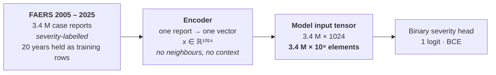
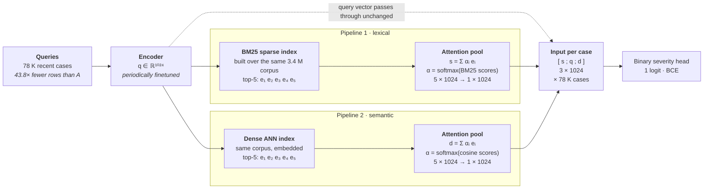

# Attention-Weighted Retrieval-Augmented Data Engineering for ADR Severity Classification
* EMNLP 2026 Industry Track 

## Reduction in Training Data: 3.7M Vectors for All 3.7M Cases vs 3 Vectors for Each Case of the Lastest 78K Cases

**FAERS · Adverse-event severity prediction · binary outcome**

Both approaches feed the same binary severity head — life-threatening ADR outcome or not. They differ entirely in what reaches the model's input layer: a twenty-two years of matrix of every case
ever filed, or three 1024-dimensional vectors per case of of 3 latest quarters — the query, plus one attention-pooled summary from each pipeline of sparse retriever (BM25) and dense vector retriever.

*The corpus does not disappear; it moves out of the training tensor and into an index.*

| Items | Value | Description |
|---|---|---|
| **Traditional input** | 3.5 × 10⁹ | elements · 3.4 M × 1024 |
| **Retrieval-augmented** | 2.4 × 10⁸ | elements · 78 K × 3 × 1024 |
| **Net reduction** | **14.6** | 43.8 × fewer rows, 3 × wider each |
| **K per pipeline** | 5 | 10 neighbours → 2 vectors |

---

## Method A — Traditional supervised training

*Every report is a training row.*



Capacity has to absorb twenty years of drift — reporting-practice changes, label
churn, new products — from the weights alone. Adding a year of data means retraining
over the whole matrix.

---

## Method B — Hybrid retrieval-augmented input

*K = 5 per pipeline · 10 neighbours pooled into 2 vectors.*



Ten retrieved neighbours never reach the classifier individually — softmax over each
pipeline's own normalised retrieval scores collapses each top-5 into a single 1024-d
summary, so the sequence the head sees is always exactly three tokens wide.

---

## To scale — input tensor volume

Float elements reaching the model:

| Method | Shape | Elements | fp16 | Relative |
|---|---|---:|---:|---:|
| **A** — traditional | 3.4 M × 1024 | 3,500,000,000 | ~ 7 GB | 100 % |
| **B** — retrieval-augmented | 78 K × 3 × 1024 | 240,000,000 | ~ 0.5 GB | **6.8 %** |

```
A  ████████████████████████████████████████████████████████████████  3.5 × 10⁹
B  ████                                                              2.4 × 10⁸
```

The remaining reports are still doing work: they sit in the two retrieval indices, consulted per query instead of
memorised in weights.
---

## What the smaller tensor costs

### Method B gains

|Gains|Explanation|
|---|---|
| **43.8x** | **Smaller input tensor.** Shorter epochs, a model that fits where the full matrix does not. |
| **3×** | **Evidence per case.** The head sees precedent — five lexical and five semantic analogues — not one isolated report. |
| **0 s** | **Refresh without retraining.** New reports enter the index and are retrievable immediately; the classifier is untouched. |
| **2×** | **Complementary recall.** BM25 catches verbatim drug and reaction terms; dense search catches paraphrase and misspelling. |

### Method B pays

|Pays|Explanation|
|---|---|
| **Build** | **Two indices over 3.4 M documents.** A BM25 store and an ANN store, both kept in sync with the corpus. |
| **Recur** | **Periodic embedding-model finetuning.** As drug vocabulary and reporting language drift, the dense index must be re-embedded — a full pass over the corpus each time. |
| **Serve** | **Retrieval on the inference path.** Every prediction now requires two searches plus score normalisation before the model runs. |
| **Tune** | **More moving parts.** K, the two score normalisations and the attention pooling all become hyperparameters that can silently degrade recall. |

---

Downstream of both paths: identical binary severity head, one logit, BCE.

Element counts are dense float positions in the model input tensor: `3.4e6 × 1024` and `0.08e6 × 3 × 1024`. Byte figures assume fp16 storage. Retrieval scores and per-neighbour severity labels are carried alongside the embeddings and are excluded from these counts as model input.

